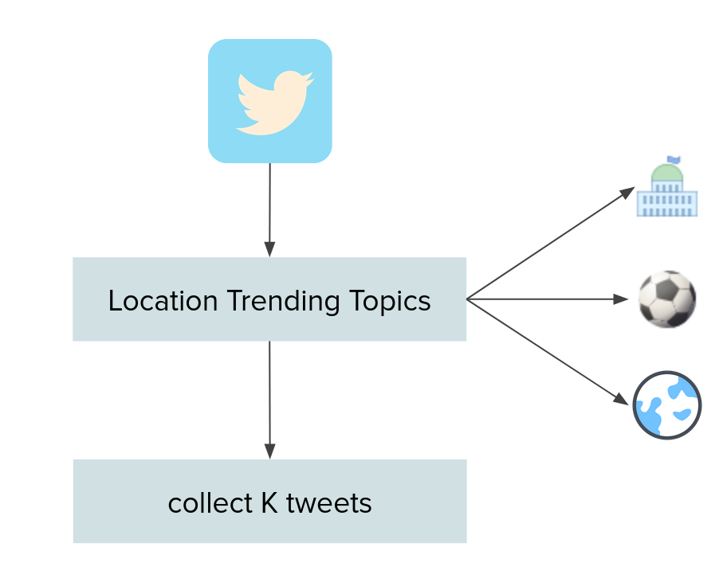

# Twitter Developer Platform: Using Twitter APIs for Academic Research

All the scripts require a config.ini file in which the keys are put. There is a task-specific readme in 
every folder.

You can install the required packages (tweepy and pymongo) with:

    pip install -r requirements.txt

## Part I - Building a Representative Dataset of a Location/Language

**Use Case**: When there's the need to collect data in a specific language to build a dataset that is somewhat
representative. We don't want to track keywords. Instead, we can collect trending topics for a place and track those.

This script can be combined with [cron](https://en.wikipedia.org/wiki/Cron) to automatically downloads data every day.
In a few days you can get a fairly rich dataset that can be used for further analysis.

This process is also described in the following [paper](https://aclanthology.org/2021.wassa-1.8/):

    Bianchi, F., Nozza, D., & Hovy, D. (2021, April). 
    FEEL-IT: Emotion and sentiment classification for the italian language. 
    In WASSA (pp. 76-83).

## Part II - Quick and Dirty Storage with MongoDB

**Use Case**: When there's the need to put up a quick streaming pipeline to track some keywords and
to store them somewhere safe without thinking too much. [MongoDB](https://www.mongodb.com/) is a good solution because set up
should be easy and python has a great integration with it thanks to [PyMongo](https://pymongo.readthedocs.io/en/stable/).

## Part III - Reconstructing Conversations on Twitter

**Use Case**: This just showcases how to reconstruct conversations given a single Tweet Id.

# Acknowledgements

I'd like to thank Debora Nozza and Dirk Hovy, that contributed to the work done for Part I and Mesut Kaya and Rishav Hada that are the principal contributors for the reconstructing conversations task (Part III).

Icons by [Icon8](https://icons8.com/icons/)